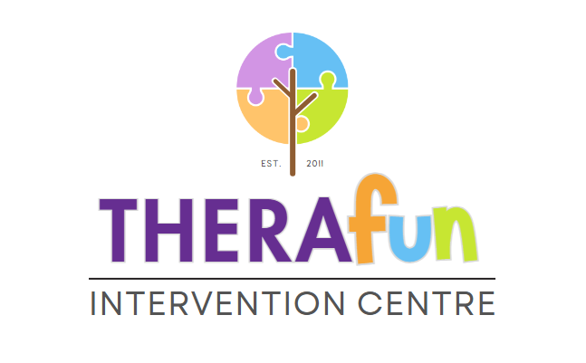

<p align="center">
  
</p>

<h1 align="center">TheraConnect</h1>

<p align="center">
  <strong>A web-based intelligent learning and communication system for speech therapy services</strong><br />
  Built for TheraFun Intervention Centre · Balanga City, Bataan
</p>

---

## Overview

TheraConnect brings everything a therapy centre runs on into one place: scheduling, enrollment, progress tracking, home practice, and parent–therapist communication. It replaces paper appointment boards, scattered phone calls, and chat threads with a single portal that the front desk, therapists, and families all share.

Each person signs in to a workspace built around their role:

| Role | What they use it for |
|---|---|
| **Admin / Front desk** | Running the schedule, approving enrollments, managing clients, sending announcements, and tracking how the centre is growing |
| **Therapist** | Seeing their caseload, recording session notes and progress, assigning home practice, and messaging families |
| **Parent / Guardian** | Following their child's sessions, progress, and homework, and talking directly with the therapist |

Services covered: Speech Therapy, Occupational Therapy, Physical Therapy, Special Education Tutorial, Playgroup Classes, Early Intervention, and Childcare (via **TheraFun Play**).

---

## Features

### Public website
- Modern landing page with the centre's services, background, and contact details
- Separate **TheraFun Play** page for daycare and playgroup families
- **Online enrollment**: a step-by-step form with the child's details (last, first, and middle name), guardian information, chosen treatment, and diagnosis upload
- **FAQ chatbot** that answers common questions about hours, services, rescheduling, and cancellations

### Admin
- **Weekly schedule** (Mon–Sat calendar) to create, edit, and cancel sessions, with automatic double-booking prevention
- **Registration review**: approve or reject online enrollments after checking the diagnosis. Approved children are automatically assigned to an available therapist of the right specialty
- **Client roster**: add and manage children and their guardians
- **Announcements** posted in the portal and emailed to every family
- **SMS and email notifications** for reminders and confirmations, with a full notification log
- **Automation Center**
  - *Operations*: recommended actions, a smart scheduling queue for clients without upcoming sessions, therapist workload, missing session notes, and progress review flags
  - *Growth & Stats*: enrollment growth, sessions booked over time, attendance rate, clients by service, sessions by status, and therapist utilization, shown as line, bar, and pie charts
  - *Reports*: downloadable **daily and weekly PDF summary reports** with the TheraFun logo
  - *Maintenance*: database health, record counts, one-click backup download, and safe cleanup of old logs

### Therapist
- **My schedule** with today's and upcoming sessions
- **Progress & notes**: treatment goals, session measurements, and an assisted note writer that drafts notes for the therapist to review and approve
- **Goal forecast**: estimates how many more sessions a child needs to reach each goal, based on their progress so far
- **Classwork**: assign home-practice worksheets, review what families submit, and grade with star ratings and feedback
- **Messages** with each family on their caseload

### Parent
- **Home dashboard** with upcoming sessions, notifications, and announcements
- **Confirm attendance** for upcoming sessions in one tap
- **Child progress**: goals, trends, overall progress, and an estimated finish date for each goal
- **Classwork**: see assigned home practice and submit completed work with a photo or note
- **Messages** with their child's therapist
- **Enrollment status** for their online application

### Messaging
- Live chat between parents and therapists that refreshes automatically
- Send **photos** with captions, and tap to view them full screen
- **Edit**, **unsend**, and **copy** messages
- Speech-bubble design with date dividers, grouped messages, and a **"Seen"** status
- Photos are private to the family, their therapist, and the admin

---

## Benefits

**For families**
- One place for schedules, progress, homework, and therapist contact, with no more chasing updates by phone
- Enroll online without visiting the centre first
- See real progress between sessions and know what to practice at home
- Reminders mean fewer missed sessions

**For therapists**
- Less paperwork: notes are drafted for them, and progress is charted automatically
- Clear view of each child's goals and how close they are
- Home practice and family communication handled in the same system as the sessions

**For the centre**
- No double bookings, and a fair, automatic way to assign new clients to therapists
- Faster enrollment with a clear approval process
- Live business insight (enrollment growth, attendance, therapist workload) and printable reports for meetings and records
- Built-in backups and maintenance tools to keep data safe
- Every automated suggestion is reviewed by a person: the system recommends and summarizes, while staff stay in control of schedules and clinical notes

---

## Built with

React · Vite · Tailwind CSS · Node.js · Express · SQLite · FullCalendar · Recharts

## Getting started

```bash
# Backend
cd backend
npm install
npm run seed     # demo data and accounts
npm run dev      # http://localhost:4000

# Frontend (in a second terminal)
cd frontend
npm install
npm run dev      # http://localhost:5173
```

### Demo accounts

| Role | Email | Password |
|---|---|---|
| Admin | `admin@theraconnect.ph` | `admin123` |
| Therapist | `anna@theraconnect.ph` | `therapist123` |
| Parent | `parent1@theraconnect.ph` | `parent123` |

---

<p align="center">
  Thesis project · <em>TheraConnect: A Web-Based Intelligent Learning and Communication System for Speech Therapy Services</em>
</p>
